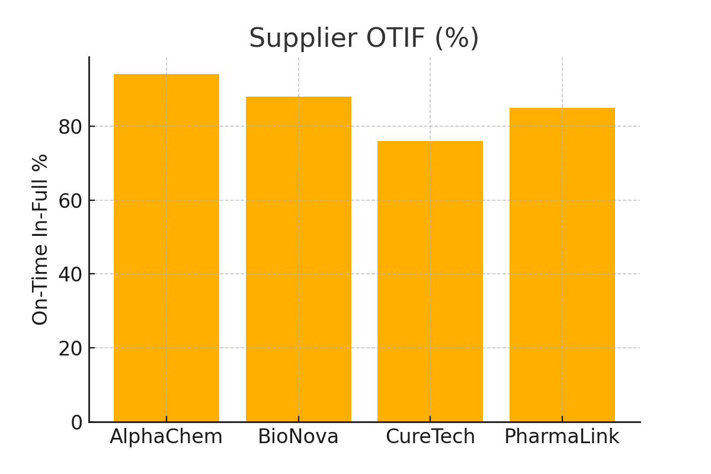
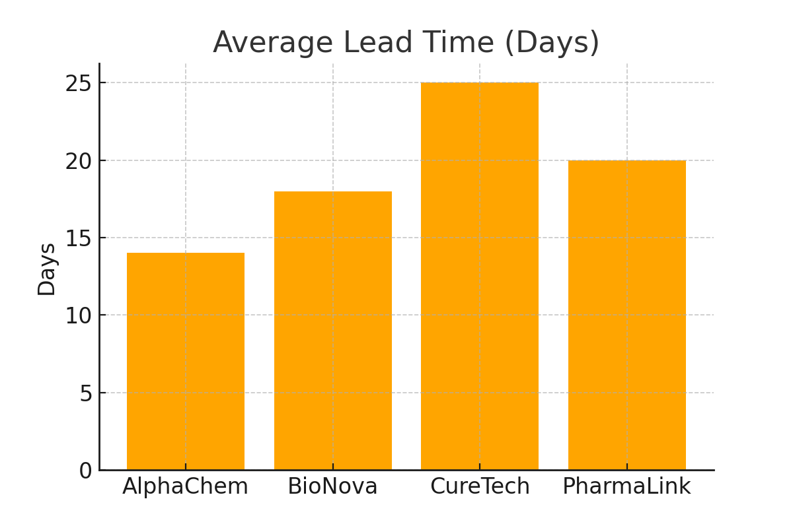
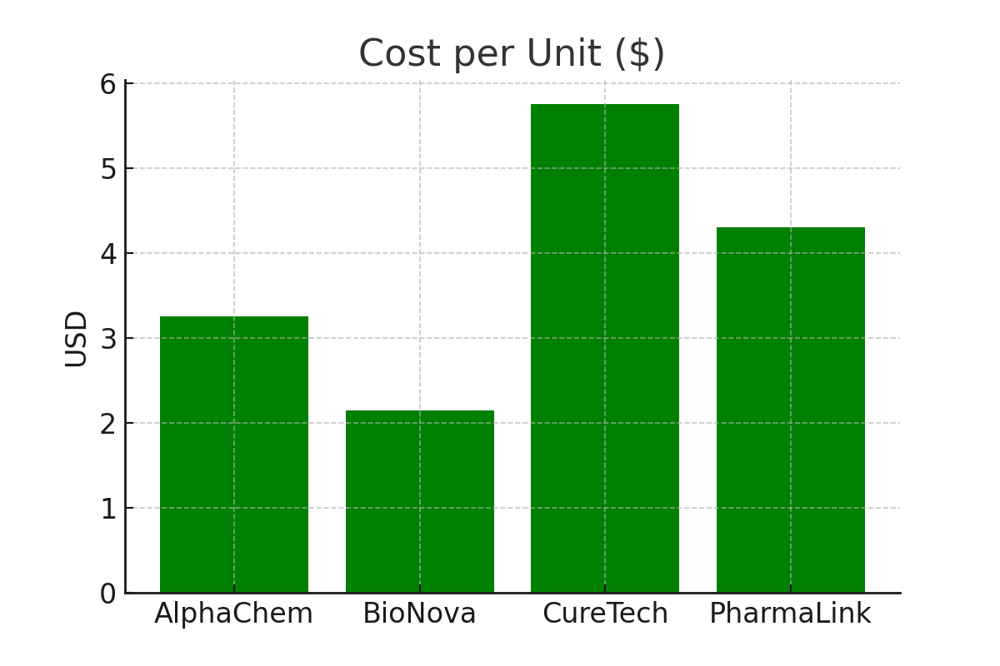
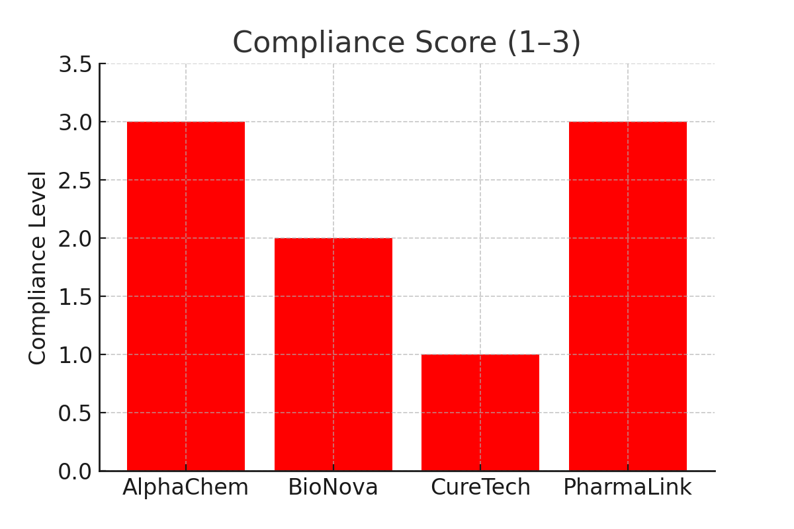

# 🌍 Global Sourcing Dashboard – Abheshu Pharma

### 📌 Created by **Dadi Naveen**  
> 🎓 M.S. Business Analytics – University of New Haven  
> 📍Baltic, CT, USA | 📧 dnave1@unh.newhaven.edu  
> 💼 [LinkedIn](https://linkedin.com/in/naveendadi) | 💻 [GitHub](https://github.com/dadinaveen1729)

---

### 🌟 Dedicated to **Vanitha Poojary**  
**Managing Director & CEO, Abheshu Pharma LLC – Texas, USA**

Dear Vanitha Mam,  
Your visionary leadership and dedication to making "Health Delivered Worldwide" a reality is truly inspiring. This project is a small tribute to your journey, with the hope that it aligns with your strategic vision for global sourcing excellence. It would be an honor to contribute to your team.

---

## 💡 About This Project

This dashboard was created specifically for **Abheshu Pharma** to simulate and support global pharmaceutical sourcing. It addresses common challenges in sourcing APIs (Active Pharmaceutical Ingredients), RLDs (Reference Listed Drugs), FDFs (Finished Dosage Forms), comparator drugs, and excipients from international suppliers.

As an aspiring **Associate Manager – Global Sourcing**, this project reflects how I think, plan, and execute sourcing decisions that are:

- Compliant
- Predictable
- Cost-efficient
- Supplier-transparent

---

## 🎯 What Problem It Solves

**Abheshu’s Challenge** | **How This Project Helps**
:--|:--
Unpredictable lead times & supplier delays | Tracks OTIF%, delivery trends, and lead time variances
Inconsistent pricing across geographies | Benchmarks costs per unit for negotiation-ready analysis
Compliance risks from multiple vendors | Scores each supplier on GMP, CoA, and audit readiness
Supply scrap and wastage | Highlights high-risk materials for expiry/scrap alerts

---

## ⚙️ Features

- ✅ **Supplier OTIF Tracker**: Who delivers on-time and in-full
- 🧠 **Compliance Scorecard**: Are vendors audit-ready? CoA available?
- 🕒 **Lead Time Trends**: Helps plan faster procurement decisions
- 💵 **Cost Benchmarking**: Compare price per unit across vendors
- 📦 **Material Scrap Risk**: Identify waste-prone APIs/FDFs before it hurts

---

## 🛠️ Tools Used

- **Power BI**: Dashboards for supply KPIs
- **Python**: Risk flags, lead time automation
- **Excel**: Costing analysis, RFx comparison
- **SAP (simulated)**: Material master & vendor profile tracking

---

## 📊 Dashboards & Visuals

### 📌 Supplier OTIF % Comparison

> Identifies which suppliers are most reliable — helps optimize partner selection and reduce missed timelines.

### 📌 Lead Time by Supplier

> See where delays happen — source from faster geographies or improve contract terms.

### 📌 Cost per Unit Benchmark

> Know which vendor offers the best deal for the same quality — reduces negotiation time and increases profit margins.

### 📌 Compliance Score

> Regulatory risk? Not anymore. Track who is audit-ready and GMP compliant, at a glance.

---

## 👤 About Me – Why I’m a Fit

With 4+ years of experience in:
- 📦 Procurement operations (India & U.S.)
- 🧪 API/RLD sourcing
- 📉 Cost & scrap reduction
- 🧮 SAP S/4HANA, Power BI, Python
- 📑 GMP/CoA documentation workflows

And a mindset shaped by my Business Analytics training + Harvard Exec Strategy certificate, I bring:

✅ Strategic thinking  
✅ Data-driven decisions  
✅ Passion for global health systems  

---

## ❤️ Final Note to Abheshu Pharma

> This project isn’t just code and charts — it’s a simulation of what I’ll bring to your team: passion, precision, and purpose.

Dear Vanitha Mam, thank you again for building such a bold and purposeful company. Your leadership motivates me to contribute meaningfully to Abheshu Pharma’s growth — and I’d be honored to do so as your next Associate Manager – Global Sourcing.

Warm regards,  
**Dadi Naveen**  
🔗 [linkedin.com/in/naveendadi](https://linkedin.com/in/naveendadi)
